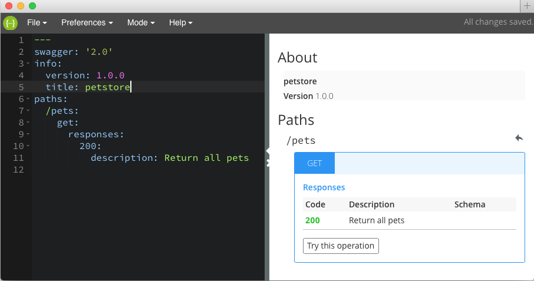

# Swagger Editor

[](https://travis-ci.org/swagger-api/swagger-editor)
[](https://codeclimate.com/github/swagger-api/swagger-editor)

Swagger Editor lets you edit API specifications in YAML inside your browser and to preview documentations in real time.
Valid Swagger JSON descriptions can then be generated and used with the full Swagger tooling (code generation, documentation, etc).

To understand how it works, you should [try the live demo](http://editor.swagger.io/#/edit)!



### YAML Syntax
YAML became a first-class citizen as part of the Swagger 2.0 working group process, however it has not yet been documented in the [Swagger Spec](https://github.com/swagger-api/swagger-spec/blob/master/versions/2.0.md). The editor opens with an example YAML file. For some other examples see '[Creating Swagger JSON from YAML files](https://github.com/swagger-api/swagger-codegen/wiki/Creating-Swagger-JSON-from-YAML-files)'

### Importing your Swagger document
You can import both Swagger 2.0 documents into Swagger Editor. Click **File** menu and select one of import methods. You can import both YAML and JSON of Swagger 2.0 documents.
You can also import an existing YAML or JOSN Swagger 2.0 specs document by using the `import` query parameter in edit mode. For example:
```
http://editor.swagger.io/#/edit?import=http://generator.wordnik.com/online/api/swagger.yaml
```
## Running Locally

Make sure you have [Node.js](http://nodejs.org/) installed. 

```shell
git clone git@github.com:swagger-api/swagger-editor.git
cd swagger-editor
npm start
```

That's it! This will open a browser window running current development version. It will reload the app if you make changes to source files.

## Development Guide
See [**Development Guide document**](./docs/development.md)

### Contributing
File issues in GitHub's to report bugs or issue a pull request.

All contributions must grant copyright permission to this project, the source of which is declared to be under an Apache 2 license (see LICENSE).
